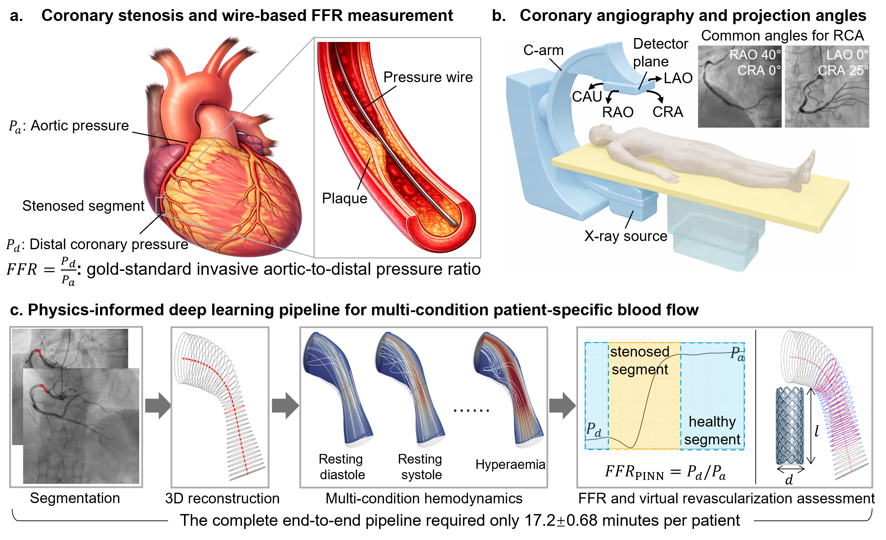

# JacobiNet blood-flow modeling

Research code for three-dimensional coronary reconstruction and physics-informed
blood-flow modeling.

## Papers

This repository accompanies the blood-flow modeling paper below and builds on
the JacobiNet coordinate-transform methodology:

1. **Blood-flow modeling paper (arXiv)**:
   [Physics-Informed Hemodynamic Modeling for Data-Free Prediction and Sparse-Data Assimilation](https://arxiv.org/abs/2609.19290).
   Xi Chen et al., arXiv:2609.19290, 2026.
2. **JacobiNet methodology paper (JCP)**:
   [Solved in unit domain: JacobiNet for differentiable coordinate-transformed PINNs](https://doi.org/10.1016/j.jcp.2026.115074).
   Xi Chen et al., *Journal of Computational Physics*, 563, 115074, 2026.

If you use this code in your research, please **cite both papers**.
See [Citation](#citation) for the BibTeX entries.

## Overview



**Overview of coronary stenosis assessment and the proposed physics-informed deep learning framework.**
**(a)** Atherosclerotic stenosis and invasive pressure-wire assessment of fractional
flow reserve (FFR), defined as distal coronary pressure divided by aortic pressure.
**(b)** C-arm coronary angiography, common right coronary artery (RCA) viewing
angles, and corresponding 2D projections.
**(c)** Manually segmented dual-view angiograms enable patient-specific 3D
centerline and radius reconstruction, followed by multi-condition hemodynamic
modeling, non-invasive FFR estimation, and proof-of-concept virtual stent
assessment. The complete workflow takes **17.2 ± 0.68 minutes per patient**.

## Code packages and data

| Resource | Purpose |
|---|---|
| [AttentionCNN_3Dreconstruction](AttentionCNN_3Dreconstruction/README.md) | Reconstruct vessel coordinates and radii from paired projection images. |
| [JacobiNetPINN_flowsolver](JacobiNetPINN_flowsolver/README.md) | Train and evaluate JacobiNet coordinates and the physics-informed flow model. |
| [RCA_generator](RCA_generator/README.md) | Generate synthetic single-RCA geometry and paired projection images. |
| [synthetic_100 dataset](https://huggingface.co/datasets/Xi-UST/JacobiNet_bloodflow/tree/main) | 100 synthetic cases with paired projections, geometry, CFD results, and evaluation references. Hosted on Hugging Face; see [data setup](data/README.md). |

The model packages include their reference weights and reproduction entrypoints.
See each package README for the tested environment, installation, inputs, outputs,
and training commands.

## Download

The AttentionCNN checkpoint uses Git LFS:

```bash
git lfs install
git clone https://github.com/xchenim/JacobiNet_bloodflow.git
cd JacobiNet_bloodflow
git lfs pull
```

## Reproduce the supplied cohort

Download the [`synthetic_100` dataset](https://huggingface.co/datasets/Xi-UST/JacobiNet_bloodflow/tree/main)
from Hugging Face and place its `synthetic_100/` directory beside the three code
packages (see [data setup](data/README.md)). Install the dependencies in the
corresponding package README, then run:

```bash
python AttentionCNN_3Dreconstruction/reproduce/evaluate.py --output-root outputs/reconstruction_100
python JacobiNetPINN_flowsolver/reproduce/evaluate.py --output-root outputs/flow_100
```

Use new output directories outside the code and input data. These entrypoints
evaluate the supplied cohort; they do not generate meshes or solve new CFD cases.

## License scope

The [MIT license](LICENSE), attributed to **Xi Chen, et al.**, applies to authorized
project-owned code. Dependencies retain their licenses.

`RCA_generator` adapts the upstream vessel generator accompanying Iyer et al.,
*A multi-stage neural network approach for coronary 3D reconstruction from
uncalibrated X-ray angiography images*. Its inherited code and control-point
assets retain academic/non-commercial terms. See its [license scope](RCA_generator/LICENSE)
and [third-party notices](RCA_generator/NOTICE.md). The repository must not be
treated as entirely MIT-licensed.

## Citation

If you use this code in your research, please cite both papers below.

### 1. Blood-flow modeling (arXiv)

```bibtex
@misc{chen2026hemodynamic,
  title         = {Physics-Informed Hemodynamic Modeling for Data-Free Prediction and Sparse-Data Assimilation},
  author        = {Chen, Xi and Yang, Jianchuan and Li, Hongde and He, Guangxin
                   and Ye, Qiuyu and Luo, Qiang and Chen, Mao and Hu, Wenqi},
  year          = {2026},
  eprint        = {2609.19290},
  archivePrefix = {arXiv},
  primaryClass  = {eess.IV},
  doi           = {10.48550/arXiv.2609.19290},
  url           = {https://arxiv.org/abs/2609.19290}
}
```

### 2. JacobiNet methodology (JCP)

```bibtex
@article{chen2026jacobinet,
  title   = {Solved in unit domain: {JacobiNet} for differentiable coordinate-transformed {PINNs}},
  author  = {Chen, Xi and Yang, Jianchuan and Zhang, Junjie and Yang, Runnan
             and Liu, Xu and Wang, Hong and Zheng, Tinghui and Ren, Ziyu and Hu, Wenqi},
  journal = {Journal of Computational Physics},
  volume  = {563},
  pages   = {115074},
  year    = {2026},
  doi     = {10.1016/j.jcp.2026.115074},
  url     = {https://doi.org/10.1016/j.jcp.2026.115074}
}
```

[CITATION.cff](CITATION.cff) records the blood-flow modeling paper as the preferred
citation and the JCP methodology paper as a related reference.
For the generator's upstream attribution, see the [RCA package README](RCA_generator/README.md).
